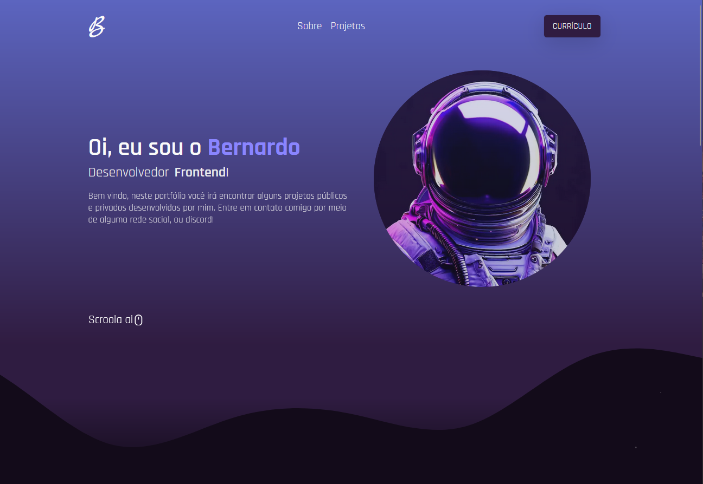

<h1 align="center">
    
</h1>

<p align="center">
   
</p>

## 🧪 Tecnologias

Esse projeto foi desenvolvido com as seguintes tecnologias:

- [React](https://reactjs.org)
- [Next JS](https://nextjs.org)
- [Styled Components](https://styled-components.com/)
- [Particles](https://github.com/matteobruni/tsparticles)
- [TypeScript](https://www.typescriptlang.org/)

## 🚀 Como executar

Clone o projeto.

```bash
$ git clone https://github.com/B-Schmitz/portfolio.git
```

Instale as depêndencias.

```bash
$ npm install | yarn
```

Execute o projeto

```bash
$ npm run start | yarn start
```

## 💻 Projeto

Portfólio para apresentar meus projetos de forma organizada e com estilo.

## 📝 License

Esse projeto está sob a licença MIT. Veja o arquivo [LICENSE](LICENSE.md) para mais detalhes.
